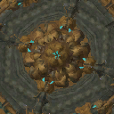
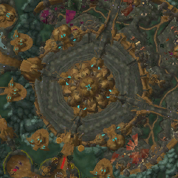
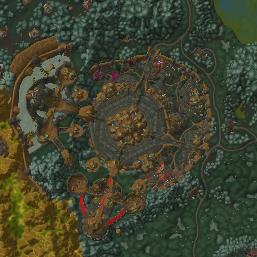

# Working with Minimap in Icecap

This guide will help you understand how to work with the Minimap service in Icecap, which allows you to render World of Warcraft minimaps based on game data.

## What is the Minimap Service?

The Minimap service in Icecap provides functionality to access and render World of Warcraft minimaps. It allows you to:

- Load minimap textures from MPQ archives
- Render minimaps for specific map IDs
- Center the minimap on specific coordinates
- Adjust the zoom level and view extent

## Basic Usage

### Setting Up the Minimap Service

To use the Minimap service, you first need to set up an MPQ archive chain and initialize the service:

```python
from icecap.infrastructure.resource import MPQArchiveChain
from icecap.services.navigation.minimap.service import MinimapService

# Load the WoW data archives
chain = MPQArchiveChain.load_archives("path/to/your/wow/Data")

# Initialize the minimap service
minimap_service = MinimapService(chain)
```

### Getting the Minimap

Once you have initialized the service, you can get the minimap data:

```python
# Get the minimap data
minimap = minimap_service.get_minimap()
```

### Rendering a Minimap

To render a minimap for a specific location, you need:
1. A map ID
2. A position (coordinates)
3. An optional extent in pixels (for zoom level)

```python
from icecap.domain.dto import Position

# Define a position (x, y, z coordinates)
position = Position(x=1000, y=2000, z=100)

# Define the map ID (e.g., 0 for Eastern Kingdoms, 1 for Kalimdor)
map_id = 1

# Render the minimap with a 64-pixel extent (zoom level)
minimap_image = minimap.render(map_id, position, extent_pixels=64)

# If you're in a Jupyter notebook, you can display the image
from IPython.display import display
display(minimap_image)

# Or save the image to a file
minimap_image.save("my_minimap.png")
```

## Advanced Usage

### Working with Map Positions

The `MapPosition` class is used to represent tile coordinates in the minimap system:

```python
from icecap.services.navigation.minimap.dto import MapPosition
from icecap.domain.dto import Position

# Create a map position directly
map_pos = MapPosition(x=32, y=32)

# Or convert from an entity position
entity_pos = Position(x=1000, y=2000, z=100)
map_pos = MapPosition.from_entity_position(entity_pos)

print(f"Map tile coordinates: ({map_pos.x}, {map_pos.y})")
```

### Accessing Map Tiles

You can access individual map tiles if needed:

```python
# Get a specific map
map_obj = minimap.maps.get(map_id)
if map_obj:
    # Get a specific tile
    tile = map_obj.tiles.get(MapPosition(x=32, y=32))
    if tile:
        # Access the tile's image
        tile_image = tile.image
        display(tile_image)
```

### Adjusting the Render Extent

The `extent_pixels` parameter controls how much of the map is shown:

```python
# Render just a single tile
single_tile = minimap.render(map_id, position, extent_pixels=0)

# Render a small area (128x128 pixels)
small_area = minimap.render(map_id, position, extent_pixels=64)

# Render a larger area (512x512 pixels)
large_area = minimap.render(map_id, position, extent_pixels=256)
```

<div class="grid cards" markdown>
- { width="300" } extent_pixels=64
- { width="300" } extent_pixels=128
- { width="300" } extent_pixels=256
</div>


## Complete Example

Here's a complete example that demonstrates how to use the Minimap service with a player's position from the game:

```python
from icecap.infrastructure.resource import MPQArchiveChain
from icecap.services.navigation.minimap.service import MinimapService
from icecap.infrastructure import GameDriver, PlayerRepository
from icecap.infrastructure.process import get_game_process_manager
from icecap.infrastructure import get_memory_manager
from IPython.display import display

# Set up the MPQ archive chain
chain = MPQArchiveChain.load_archives("path/to/your/wow/Data")

# Initialize the minimap service
minimap_service = MinimapService(chain)

# Set up the game driver and player repository to get the player's position
driver = GameDriver(get_game_process_manager(), get_memory_manager)
player_repository = PlayerRepository(driver)

# Get the player's position
player = player_repository.get_local_player()
position = player.position

# Get the current map ID
current_map_id = driver.object_manager.get_map_id()

# Get the minimap data
minimap = minimap_service.get_minimap()

# Render the minimap centered on the player's position
# with a 128x128 pixel view (64 pixels in each direction)
minimap_image = minimap.render(current_map_id, position, extent_pixels=64)

# Display the image
display(minimap_image)

# Save the image to a file
minimap_image.save("player_location_minimap.png")

print(f"Player position: {position}")
print(f"Current map ID: {current_map_id}")
```

## Understanding the Minimap Coordinate System

World of Warcraft uses a specific coordinate system for its world and minimap:

1. **World Coordinates**: The game world uses a coordinate system where (0,0) is at the center of the map, with values ranging from -MAX_MAP_COORDINATE to +MAX_MAP_COORDINATE.

2. **Minimap Tiles**: The minimap is divided into tiles, each representing a portion of the game world. These tiles are indexed by x and y coordinates.

3. **Conversion**: The `MapPosition.from_entity_position()` method converts from world coordinates to minimap tile coordinates.

```python
# The conversion formula (simplified):
x_tile = (MAX_MAP_COORDINATE - position.x) / WORLD_TILE_SIZE
y_tile = (MAX_MAP_COORDINATE - position.y) / WORLD_TILE_SIZE
```

## Next Steps

Now that you understand how to work with the Minimap service, you can:

- Create tools to visualize player movement on the map
- Build navigation systems using the minimap data
- Analyze map data for research purposes
- Create custom map visualizations

For more information about working with game resources, check out the tutorials on [Working with MPQ Archives](../assets/work_with_mpq.md) and [Working with DBC Files](../assets/work_with_dbc.md).
